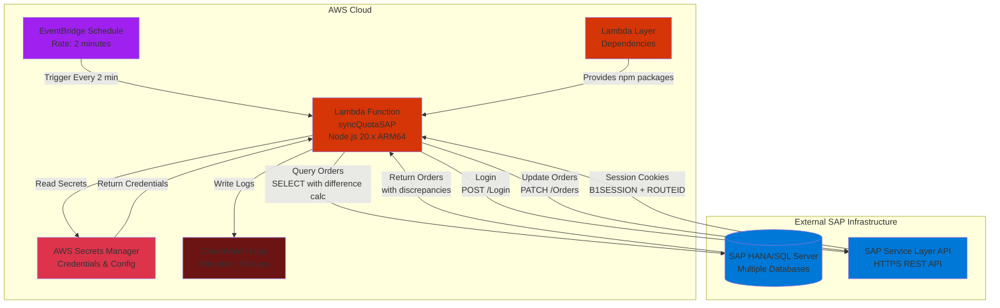

# Generic Lambdas - SAP Integration


Sistema serverless construido con AWS SAM para la sincronización automatizada de cuotas en SAP Business One mediante su Service Layer API. El sistema consulta bases de datos SAP HANA/SQL Server para detectar discrepancias en montos de plazos y ajusta automáticamente las órdenes de venta.

## Arquitectura del Sistema



## Estructura del Proyecto

```
generic-lambdas/
├── src/                              # Código fuente de Lambda
│   ├── handlers/                     # Puntos de entrada Lambda
│   │   └── syncQuotaSAP.js          # Handler principal
│   ├── controllers/                  # Lógica de negocio
│   │   └── syncQuotaSAP.controller.js
│   ├── services/                      # Servicios externos
│   │   ├── sap-service.js           # Interacción con SAP DB y Service Layer
│   │   └── secrets-manager-service.js # Cliente AWS Secrets Manager
│   ├── utils/                        # Utilidades
│   │   └── tools.js                 # Helpers (carga de secretos)
│   └── schemas/                      # Validaciones (vacío actualmente)
├── dependencies/                     # Lambda Layer
├── coverage/                         # Reportes de pruebas (generado)
├── template.yaml                     # SAM template principal
├── template-layer.yaml               # SAM template para layer independiente
├── samconfig.toml                    # Configuración multi-ambiente
├── install-layer.ps1                # Script para instalar dependencias
├── package.json                      # Metadata del proyecto
└── README.md                         # Este archivo
```

## Componentes Principales

### Handler (`syncQuotaSAP.js`)
Punto de entrada de Lambda que:
1. Carga secretos desde AWS Secrets Manager
2. Invoca el controlador de negocio
3. Maneja errores globales y logging

### Controller (`syncQuotaSAP.controller.js`)
Orquesta la lógica de sincronización:
1. Maneja operaciones logicas, llamadas a servicios
2. Se predispone la respuesta y los datos que llevara

### Services (`sap-service.js`)
Cliente unificado para SAP:
- **Conexiónes DB**: Pool de conexiones MSSQL con cifrado TLS
- **Consulta servicios externos**: Se encarga de consultar tanto db y apis externas para manejar errores fuera de nuestro controlador  

## Configuración de AWS SAM

### Template Principal (`template.yaml`)

Define la infraestructura completa:

**Parámetros**:
- `ENV`: Ambiente (dev/qa/prod)
- `LogLevel`: Nivel de logs (trace/debug/info)
- `SecretName`: Nombre del secreto en Secrets Manager

**Recursos**:
- **Lambda Layer**: Empaqueta dependencias npm (`axios`, `mssql`, `@aws-sdk/client-secrets-manager`, etc.)
- **Log Group**: CloudWatch con retención de 90 días
- **Lambda Function**:
  - Runtime: Node.js 20.x ARM64
  - Timeout: 900s (15 min)
  - Memory: 512 MB
  - IAM Policy: Acceso a Secrets Manager
  - Event: Schedule de EventBridge (rate: 2 minutes)

### Configuración Multi-Ambiente (`samconfig.toml`)

Gestiona despliegues en diferentes ambientes:

| Ambiente | Stack Name | Secret Name | Log Level | Confirm Changeset |
|----------|-----------|-------------|-----------|-------------------|
| **dev** | generic-lambdas-dev | Secret_lambda | trace | true |
| **qa** | generic-lambdas-qa | slc-update-orders-sap-secrets-qa | debug | true |
| **prod** | generic-lambdas-prod | Secret_lambda | debug | false |

Características:
- Build cacheado y paralelo
- S3 bucket auto-resuelto
- Capabilities: `CAPABILITY_IAM`

## Lambda Layer - Gestión de Dependencias

### ¿Por qué usar Lambda Layers?

Los Lambda Layers permiten:
- Separar código de dependencias
- Reutilizar librerías entre funciones
- Reducir tamaño del deployment package
- Acelerar despliegues (layer solo se actualiza cuando cambian deps)

### Estructura del Layer

```
dependencies/
└── nodejs/              # Nombre fijo requerido por AWS
    ├── package.json     # Define dependencias
    └── node_modules/    # Instalado por install-layer.ps1
```

### Instalación de Dependencias

El script `install-layer.ps1` automatiza la instalación:

```powershell
# Script para instalar las dependencias del layer
Write-Host "Instalando dependencias del layer..." -ForegroundColor Green

# Navegar a la carpeta de dependencias
Set-Location -Path "$PSScriptRoot\dependencies\nodejs"

# Instalar solo las dependencias de producción
npm install

Write-Host "Dependencias instaladas correctamente en dependencies/nodejs/" -ForegroundColor Green
Write-Host "Ahora puedes hacer el build y deploy con SAM" -ForegroundColor Yellow

cd ..
cd ..
```

**Uso**:
```powershell
.\install-layer.ps1
```

### Dependencias Incluidas

| Paquete | Versión | Propósito |
|---------|---------|-----------|
| `@aws-sdk/client-secrets-manager` | ^3.0.0 | Acceso a AWS Secrets Manager |
| `axios` | ^1.6.0 | HTTP client para SAP Service Layer |
| `mssql` | ^10.0.0 | Conexión a SQL Server/HANA |
| `uuid` | ^9.0.0 | Generación de tracking IDs |
| `loglevel` | ^1.9.2 | Sistema de logging |
| `joi` | ^18.0.2 | Validación de esquemas |

### Template del Layer (`template-layer.yaml`)

Permite despliegue independiente del layer:

```yaml
Resources:
  GenericToolsDependenciesLayer:
    Type: AWS::Serverless::LayerVersion
    Properties:
      LayerName: !Sub "generic-tools-dependencies-${ENV}"
      ContentUri: ./dependencies/
      CompatibleRuntimes:
        - nodejs20.x
      CompatibleArchitectures:
        - arm64
    Metadata:
      BuildMethod: nodejs20.x
```

**Despliegue solo del layer**:
```powershell
sam build -t template-layer.yaml
sam deploy -t template-layer.yaml --parameter-overrides ENV=dev
```

## Guía de Uso

### Prerrequisitos

1. **AWS CLI** configurado con perfil apropiado
2. **AWS SAM CLI** instalado
3. **Node.js 20.x** instalado localmente
4. **PowerShell** (Windows) o Bash (Linux/Mac)
5. **Secreto en AWS Secrets Manager** con credenciales SAP

### Instalación Inicial

#### 1. Instalar dependencias del layer

```powershell
.\install-layer.ps1
```

Esto instalará todos los paquetes npm en `dependencies/nodejs/node_modules/`.

#### 2. Configurar secreto en AWS Secrets Manager

Crear un secreto con formato JSON:

```json
{
  "Ejemplo_env_1": "",
  "Ejemplo_env_2": "",
}
```

### Despliegue

#### Ambiente DEV

```powershell
# Build
sam build --cached --parallel

# Deploy
sam deploy --config-env dev --profile your-aws-profile
```

#### Ambiente QA

```powershell
sam build --cached --parallel
sam deploy --config-env qa --profile your-aws-profile
```

#### Ambiente PROD

```powershell
sam build --cached --parallel
sam deploy --config-env prod --profile your-aws-profile
```

El ambiente prod tiene `confirm_changeset = false`, por lo que despliega automáticamente sin confirmación.

### Comandos Útiles

#### Ver logs en tiempo real

```powershell
sam logs --stack-name generic-lambdas-dev --tail --profile your-aws-profile
```

#### Invocar localmente (testing)

```powershell
sam local invoke syncQuotaSAP --event events/test-event.json
```

#### Eliminar stack completo

```powershell
sam delete --stack-name generic-lambdas-dev --profile your-aws-profile
```

#### Actualizar solo el layer

```powershell
.\install-layer.ps1
sam build -t template-layer.yaml
sam deploy -t template-layer.yaml --config-env dev --profile your-aws-profile
```

## Monitoreo y Logs

### CloudWatch Logs

Los logs se almacenan en:
```
/aws/lambda/generic-lambdas-{ENV}-syncQuotaSAP
```

**Niveles de log por ambiente**:
- DEV: `trace` (máximo detalle)
- QA/PROD: `debug`

```

### Métricas Recomendadas

1. **Duration**: Tiempo de ejecución (debe ser < 900s)
2. **Errors**: Fallos de ejecución
3. **Throttles**: Límite de concurrencia alcanzado
4. **Custom Metrics**: Crear alarmas para `facturasConError.length > 0`

## Lógica de Negocio

### Detección de Discrepancias

El sistema ejecuta esta query SQL en cada base de datos:


## Seguridad

### IAM Permissions

La Lambda requiere:
```yaml
Policies:
  - Statement:
    - Effect: Allow
      Action:
        - secretsmanager:GetSecretValue
      Resource: !Sub "arn:aws:secretsmanager:${AWS::Region}:${AWS::AccountId}:secret:${SecretName}*"
```


## Troubleshooting

### Error: "No hay sesión activa"

**Causa**: El login en SAP Service Layer falló.

**Solución**: Verificar credenciales en Secrets Manager y URL del Service Layer.

### Error: "Connection timeout" a DB

**Causa**: Lambda no puede alcanzar SQL Server.

**Solución**: 
- Verificar Security Groups
- Considerar usar VPC Lambda con acceso al servidor
- Verificar firewall del servidor SAP

### Layer no se encuentra

**Causa**: Layer no desplegado o región incorrecta.

**Solución**:
```powershell
.\install-layer.ps1
sam build
sam deploy --config-env dev
```

### Diferencias no se detectan

**Causa**: Query SQL no retorna resultados.


## Licencia

MIT

---

**Última actualización**: Noviembre 2025
